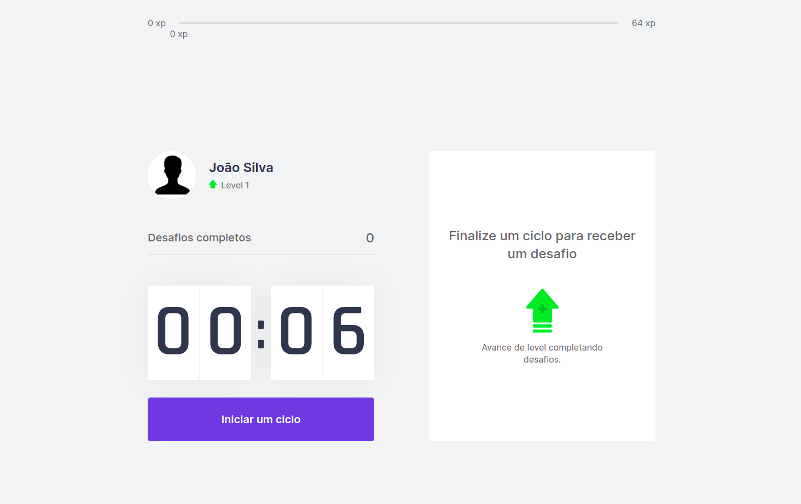
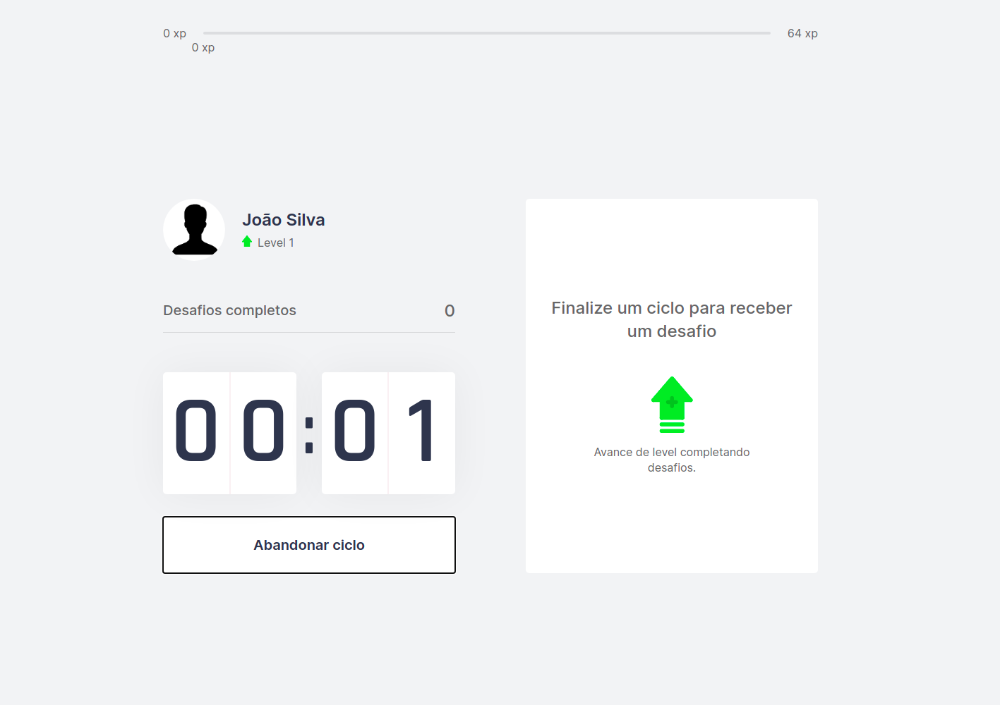
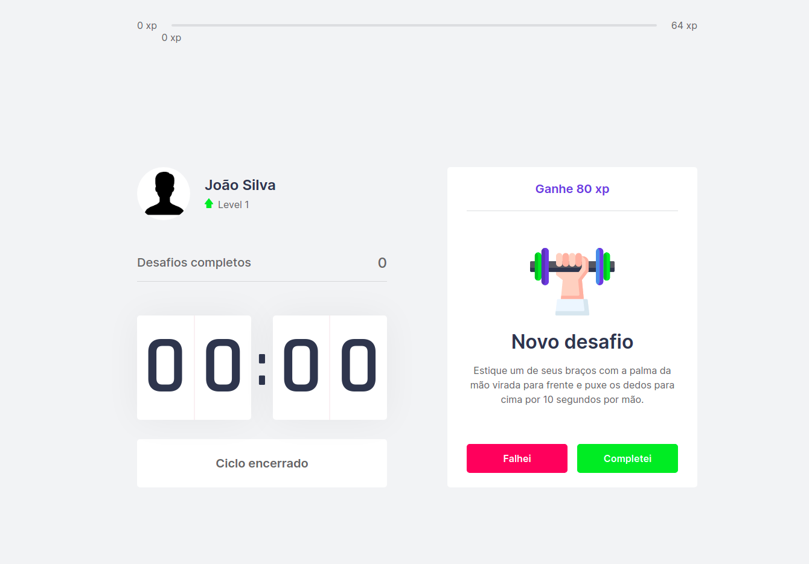
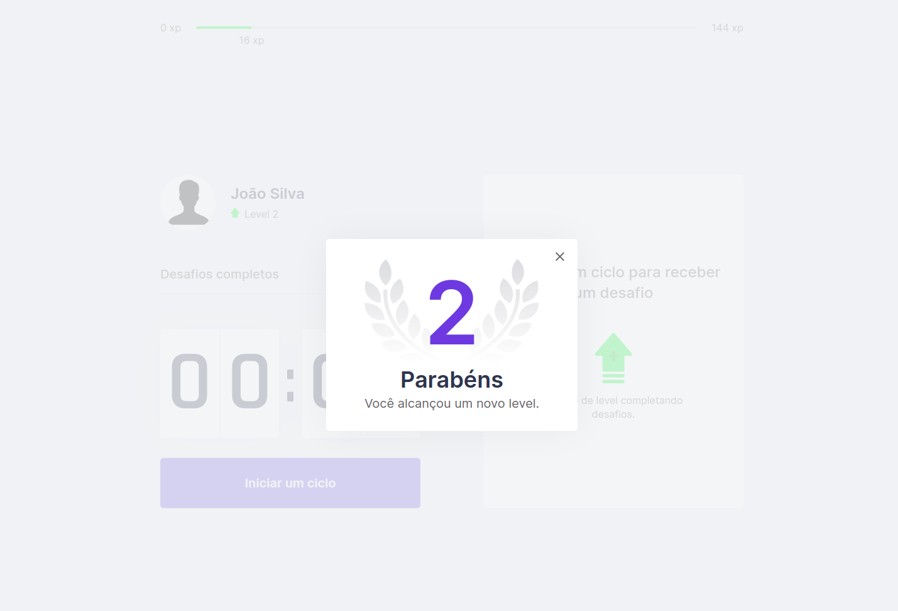

<div align="center">
  
  <br />
  <p align="center">
    
    
  </p>
</div>

# :memo: About this project
Moveit is a game app to help you exercise in your work or study routines, amid the growth of the home office during the covid-19 pandemic, many people spend hours in front of the computer doing their tasks, or even studying on online platforms, moveit provides you with basic exercises that you can perform and reduce the negative impact on your health, in certain work/studies cycles (25 minutes) you take a break to perform the activity indicated by the app, when doing this activity earns you points and goes up in level.

# :rocket: Main technologies
<ul>
  <li><a target="_blank" href="https://nextjs.org/docs/getting-started">NextJS</a></li>
  <li><a target="_blank" href="https://www.typescriptlang.org/docs/">Typescript</a></li>
  <li><a target="_blank" href="https://github.com/js-cookie/js-cookie">js-cookie</a></li>
</ul>

# :cyclone: How to run this project
```bash
# Clone this repository
$ git clone https://github.com/jefferson1104/moveit-nextJS.git

# Access directory project
$ cd moveit-nextJS
$ code . 

# Install all dependencies
$ yarn

# Run this application
$ yarn dev
```

# 🎨 Screenshots
<p align="center">
  
  
  
  
</p>